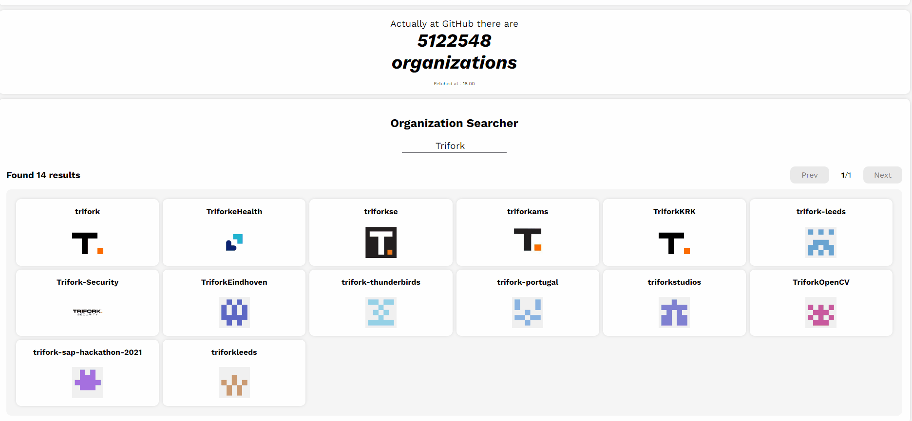
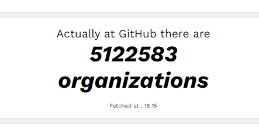
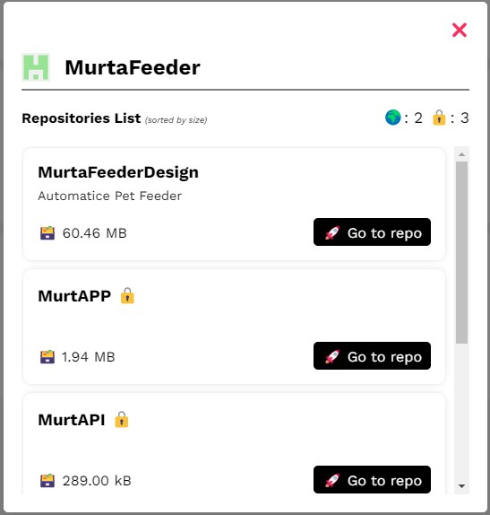

# Github Org Explorer

Github Org Explorer is a React web application that allows users to search for organizations on Github by name and view their public repositories. Additionally, the app provides information on how many organizations there are on Github.

This application was developed as part of a job application for Trifork.

## Test functionalities

#### ✅ 1. Given an organization return the number of repositories. (TF1)

#### ✅ 2. Given an organization return the biggest repository (in bytes). (TF2)

#### ✅ 3. Return the number of organizations that are currently on Github. (TF3)

## Technologies used

- Docker
- React
- Typescript
- Node.js (18.14)

## How to run it

There are two options to run this application. The first and most recommended is Docker. Alternatively, you can use a local Node installation.

### First step (common to both ways)

#### Option 1 : Clone the repository (recommended)

`git clone https://github.com/SuriSureda/GithubOrgExplorer.git`

#### Option 2 : Download source code

[Download this repository](https://github.com/SuriSureda/GithubOrgExplorer/archive/refs/heads/main.zip) and extract the .zip

### Docker (recommended)

1. Build the image with `docker build . -t <image-name>`
2. Run the container with `docker run -p <port>:3000 --name <container-name> -d <image-name>`
3. Open http://localhost:<port\> to view it in the browser. (The server may take some seconds to init)

### Node.js

1. Install all the dependencies with `npm install`

#### Production environment

2. Build the application with `npm run build`
3. Start the production server with `npx serve build`
4. Open http://localhost:3000 to view it in the browser

#### Development environment

2. Run the app with `npm start`
3. Open http://localhost:3000 to view it in the browser

## Usage

To use the app, simply enter the name of an organization in the search bar. The app will display a list of organizations that match the search term.

Click on an organization to view detailed information about it: number of repositories [(TF1)](#✅-1-given-an-organization-return-the-number-of-repositories-tf1) and listed repositories sorted by descending size [(TF2)](#✅-2-given-an-organization-return-the-biggest-repository-in-bytes-tf2).

It also provides, at real time, how many organizations there are currently on Github [(TF3)](#✅-3-return-the-number-of-organizations-that-are-currently-on-github-tf3). It fetches the API every minute.

Due to some limitations with anonymous calls to the Github API, it is possible that the app may stop working. To avoid or delay this error, it is recommended to provide a Github token to use in API calls. If a token with the corresponding rights to the organization being searched for is provided, more information will be provided about its repositories.

